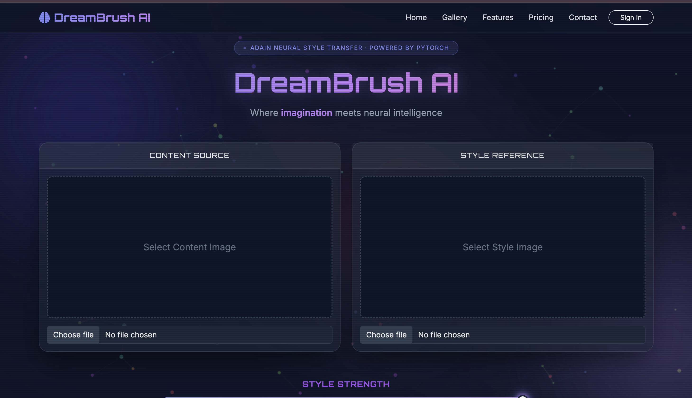
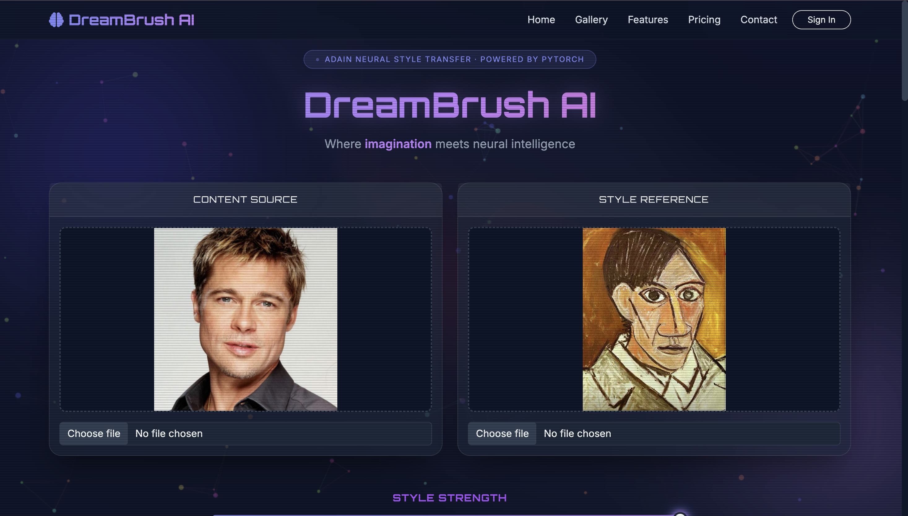
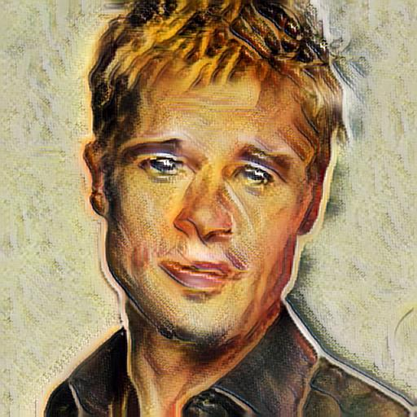
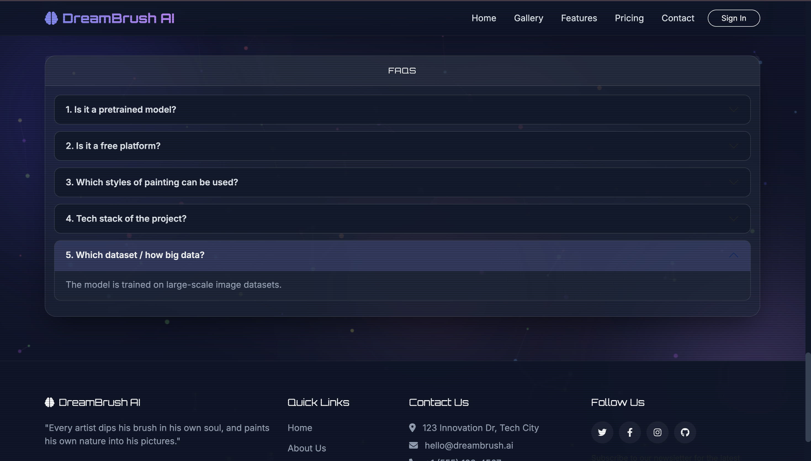

<div align="center">
# 🎨 Neural Style Transfer — AdaIN
 
### *Transform any photo into a work of art with the power of deep learning*
 
[](https://www.python.org/)
[](https://flask.palletsprojects.com/)
[](https://pytorch.org/)
[](https://render.com/)
[](LICENSE)
 
<br/>
<!-- Replace with your actual demo GIF or screenshot -->

 

 
</div>
---
 
## 📖 Table of Contents
 
- [About the Project](#-about-the-project)
- [How AdaIN Works](#-how-adain-works)
- [Demo & Screenshots](#-demo--screenshots)
- [Features](#-features)
- [Project Structure](#-project-structure)
- [Installation](#-installation)
- [Running the App](#-running-the-app)
- [Deploying to Render](#-deploying-to-render)
- [Dependencies](#-dependencies)
- [Credits & References](#-credits--references)
---
 
## 🖼️ About the Project
 
**Neural Style Transfer with AdaIN** is a Flask web application that blends the *content* of one image with the *artistic style* of another — in real time. Powered by **Adaptive Instance Normalization (AdaIN)** and a pre-trained VGG encoder/decoder network, the app lets you:
 
1. Upload a **content image** (your photo, landscape, portrait — anything)
2. Upload a **style image** (a painting, artwork, or texture)
3. Adjust the **style strength (alpha)** to control how heavily the style is applied
4. Download the **stylized output** — a brand-new artistic image
Unlike traditional optimization-based style transfer (which can take minutes), AdaIN produces results in **seconds**, making it practical for real-world use.
 
---
 
## 🧠 How AdaIN Works
 
> *A beginner-friendly explanation*
 
Think of every image as having two things: **content** (the shapes and structure — what's *in* the image) and **style** (the colors, textures, and brush strokes — how it *looks*).
 
**AdaIN (Adaptive Instance Normalization)** transfers style by matching statistical properties between images:
 
```
Content Image ──┐
                ├──► VGG Encoder ──► AdaIN Layer ──► Decoder ──► Stylized Image
Style Image   ──┘
```
 
Here's the key idea, step by step:
 
1. **Encode** — Both the content image and style image are passed through a pre-trained VGG network, which extracts their deep feature representations (essentially, a "description" of their content and style).
2. **Normalize** — The AdaIN layer takes the content features and *adjusts their mean and variance* to match those of the style features. This is the magic — it's like dipping the content into the statistical "fingerprint" of the style.
   The formula is elegantly simple:
   ```
   AdaIN(x, y) = σ(y) * ((x − μ(x)) / σ(x)) + μ(y)
   ```
   where `μ` is the mean and `σ` is the standard deviation.
3. **Decode** — A decoder network reconstructs a full image from the normalized features, producing the final stylized result.
4. **Alpha blending** — An `alpha` parameter (0.0 → 1.0) lets you control the style intensity. `alpha = 1.0` gives full style transfer; lower values preserve more of the original photo.
This approach is **fast** (no iterative optimization) and **flexible** (works with any arbitrary content/style pair at inference time).
 
---
 
## 📸 Demo & Screenshots
 
     
 
**Web Interface:**
 


---
 
## ✨ Features
 
- 🖼️ **Upload any image** as content or style — JPG, JPEG, PNG supported
- 🎚️ **Adjustable alpha slider** to fine-tune how much style is applied
- ⚡ **Fast inference** — results generated in seconds using AdaIN
- 🧠 **VGG-based encoder** with a trained decoder for high-quality output
- 🌐 **Clean web UI** built with Flask-Bootstrap
- 🔒 **Secure file handling** via Werkzeug's `secure_filename`
- ☁️ **Cloud-deployed** on Render for easy access from any browser
- 💻 **CPU & GPU compatible** — auto-detects available hardware
---
 
## 📁 Project Structure
 
```
AI-Neural-Style-Transfer-AdaIn/
│
├── app.py                  # Main Flask application
├── train.py                # Model training script
├── vgg_normalised.pth      # Pre-trained VGG encoder weights
├── requirements.txt        # Python dependencies
├── Procfile.txt            # Render/Gunicorn startup command
├── adain_algo.png          # AdaIN algorithm diagram
├── .gitignore
│
├── utils/
│   ├── models.py           # VGGEncoder and Decoder architectures
│   └── utils.py            # AdaIN core logic (adaptive_instance_normalization, calc_mean_std)
│
├── templates/
│   └── index.html          # Main HTML template (Flask-Bootstrap)
│
├── static/
│   └── uploads/            # Uploaded and generated images (runtime)
│
└── examples/               # Sample content/style image pairs
```
 
---
 
## 🛠️ Installation
 
### Prerequisites
 
- Python 3.9 or higher
- `pip` package manager
- *(Optional)* A CUDA-compatible GPU for faster inference
### 1. Clone the repository
 
```bash
git clone https://github.com/saakshiscode19/AI-Neural-Style-Transfer-AdaIn.git
cd AI-Neural-Style-Transfer-AdaIn
```
 
### 2. Create and activate a virtual environment
 
```bash
# Create virtual environment
python -m venv venv
 
# Activate — macOS/Linux
source venv/bin/activate
 
# Activate — Windows
venv\Scripts\activate
```
 
### 3. Install dependencies
 
```bash
pip install -r requirements.txt
```
 
### 4. Add the decoder weights
 
The app requires a trained decoder checkpoint (`decoder_1.pth`). Update the path in `app.py`:
 
```python
# Line ~37 in app.py — update this to your local path
decoder.load_state_dict(torch.load('path/to/your/decoder_1.pth'))
```
 
> 📌 *If you've trained your own decoder using `train.py`, point this to your output checkpoint.*
 
---
 
## ▶️ Running the App
 
Start the Flask development server:
 
```bash
python app.py
```
 
Then open your browser and navigate to:
 
```
http://localhost:5000
```
 
You'll see the upload form. Select a content image, a style image, set your desired alpha value, and click **Transfer Style**!
 
---
 
## ☁️ Deploying to Render
 
This app is configured for deployment on [Render](https://render.com/) using Gunicorn.
 
### Steps
 
1. **Push your code** to a GitHub repository (ensure `Procfile.txt` and `requirements.txt` are committed).
2. **Go to [render.com](https://render.com/)** and create a new **Web Service**.
3. **Connect your GitHub repo** and configure:
   - **Build Command:** `pip install -r requirements.txt`
   - **Start Command:** `gunicorn app:app` *(from your Procfile)*
   - **Environment:** Python 3
4. **Add any environment variables** if needed (e.g., `SECRET_KEY`).
5. **Deploy** — Render will build and host your app automatically.
6. Your live app will be available at:
   ```
   https://your-app-name.onrender.com
   ```
   *(Replace with your actual Render URL)*
> ⚠️ **Note:** Render's free tier spins down after inactivity. The first request after idle may take ~30 seconds to wake up.
 
---
 
## 📦 Dependencies
 
| Package | Version | Purpose |
|---|---|---|
| `Flask` | 3.1.2 | Web framework |
| `Flask-Bootstrap` | 3.3.7.1 | UI styling |
| `flask-wtf` | 1.2.2 | Form handling & CSRF protection |
| `torch` | 2.2.2 | Deep learning framework |
| `torchvision` | 0.17.2 | Image transforms & pretrained models |
| `Pillow` | 12.0.0 | Image loading and saving |
| `numpy` | ≥1.24, <2.0 | Numerical operations |
| `Werkzeug` | 3.1.4 | WSGI utilities & secure file handling |
| `WTForms` | 3.2.1 | Form validation |
| `tqdm` | 4.66.4 | Training progress bars |
| `gunicorn` | latest | Production WSGI server (Render) |
 
Install all at once:
 
```bash
pip install -r requirements.txt
```
 
---
 
## 🙏 Credits & References
 
**Core Research:**
 
> Huang, X., & Belongie, S. (2017). *Arbitrary Style Transfer in Real-time with Adaptive Instance Normalization.*
> In Proceedings of the IEEE International Conference on Computer Vision (ICCV), 2017.
> 📄 [arXiv:1703.06868](https://arxiv.org/abs/1703.06868)
 
**Model Architecture:**
 
The encoder uses a **VGG-19** network pre-trained on ImageNet (weights normalized for style transfer), paired with a learned mirror-decoder network trained to reconstruct images from AdaIN-transformed features.
 
**Built With:**
 
- [PyTorch](https://pytorch.org/) — Deep learning framework
- [Flask](https://flask.palletsprojects.com/) — Python web framework
- [Render](https://render.com/) — Cloud deployment platform
- [Flask-Bootstrap](https://pythonhosted.org/Flask-Bootstrap/) — Frontend UI components
---
 
<div align="center">
Made with ❤️ by [saakshiscode19](https://github.com/saakshiscode19)
 
⭐ If you found this project useful, please consider giving it a star!
 
</div>
